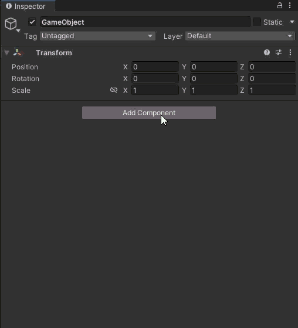
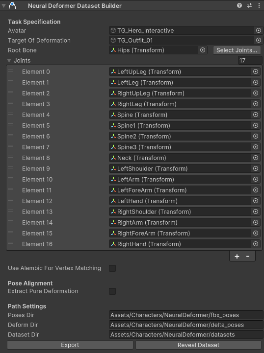
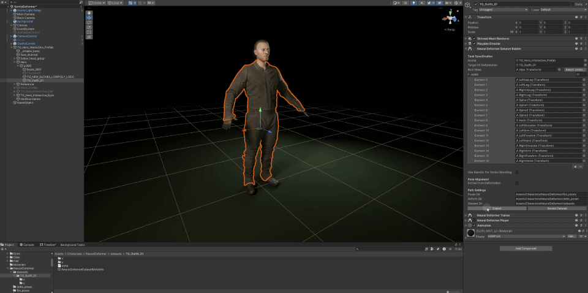
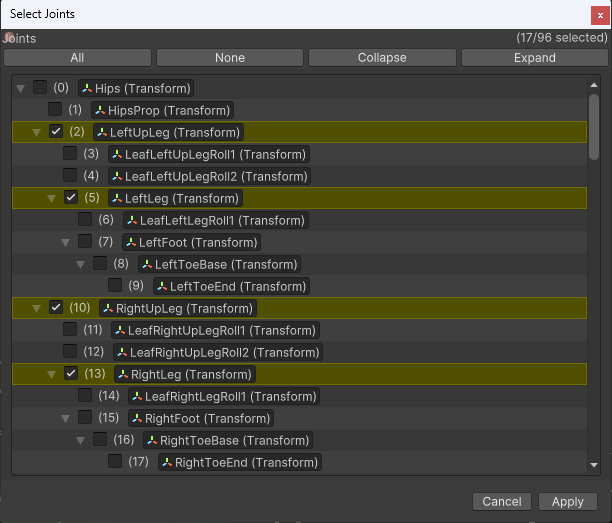
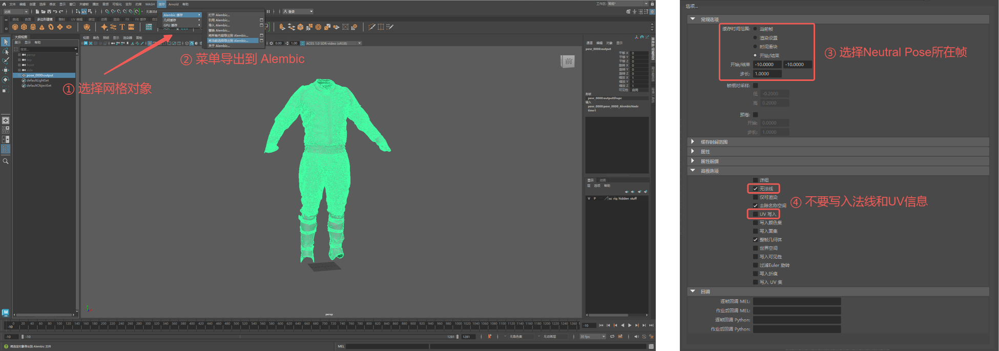
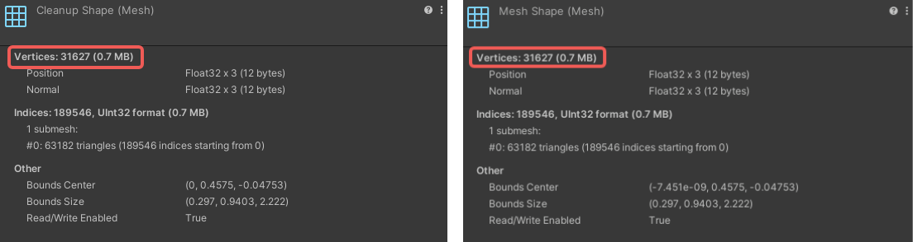

# 使用 Neural Deformer Dataset Builder 构建训练数据集

`Deformer Data Dataset Builder`组件的主要作用是：自动化地解析原始数据，提取出从角色的骨骼动画到目标网格复杂变形的对应关系，从而生成可直接用于训练神经网络的数据集。

首先，选择场景中需要变形的游戏对象，在`Inspector`下方点击`Add Compoent` \> `Neural Deformer` \> `Neural Deformer Dataset Builder`，可添加该组件：

`Deformer Data Dataset Builder`组件的`Inspector`界面如图下所示：

| 属性名称 | 详细解释 |
| --- | --- |
| **Avatar** | 用动画驱动变形的游戏对象，各组动画的 AnimationClip 将作用在该对象上。 |
| **Target Of Deformation** | 实际被施加网格变形的游戏对象，**需要带有 SkinnedMeshRenderer 组件**。 |
| **Root Bone** | 动画骨骼的根关节点对象。 |
| **Joints** | 用于预测网格变形的关节点列表，可借助骨骼层级预览便捷地选择关节点。 请参考下文[**骨骼层级预览辅助选择关节点**](dataset-builder.md#骨骼层级预览辅助选择关节点)。 |
| **Use Alembic For Vertex Matching** | 是否使用 Alembic 辅助匹配网格顶点。 在生成数据集时，需要事先完成线性蒙皮网格与复杂变形网格的顶点匹配，匹配的精确性将对最终的变形效果有直接影响。 如果在 Neutral Pose 下，上述两个网格不能完全重合，我们强烈建议勾选这个属性，并额外提供 Alembic 模型来辅助匹配网格顶点。 请参考下文[**使用 Alembic 辅助匹配网格**](dataset-builder.md#使用alembic辅助匹配网格顶点)。 |
| *Skinned Alembic* | 在 Neutral Pose 下线性蒙皮的 Alembic 模型。 |
| *Deform Alembic* | 在 Neutral Pose 下经过复杂变形后的 Alembic 模型。 注意：`Skinned Alembic` 和 `Deform Alembic`的网格顶点数量必须相等。 |
| **Extract Pure Deformation** | 是否将原始数据中的变形网格从每帧姿态统一反推回 Neutral Pose，即对网格的纯变形 Deltas 进行提取。 为了保证变形效果，神经网络的拟合目标是各个顶点在 Neutral Pose 下的偏移量。因此在预处理时，需要剔除运动姿态对顶点位置的影响。如果输入的原始数据未做此剔除，请勾选这个属性；如果已经剔除了，则不勾选。 |
| **Poses Dir** | 原始数据里多组动作序列所在的目录。 序列中的每个动作是包含了 AnimationClip 的 FBX 资产。 |
| **Deform Dir** | 原始数据里多组变形缓存序列所在的目录。序列中的每个缓存是在运动中包含复杂变形的 Alembic 资产。 注意：`Poses Dir` 里的动作和 `Deform Dir` 里的缓存数量必须相等，且按顺序一一对应。 |
| **Dataset Dir** | 构建出来的数据集的输出目录。可以是暂时不存在的路径，在实际构建时会事先创建该路径。 |

设置好所有属性后，点击下方的`Export`按键开始构建数据集。

待数据集构建完成后，可以点击`Reveal Dataset`按键进行查看。

## 骨骼层级预览辅助选择关节点

一个动画角色的骨骼层级包含众多关节点，但是可能只有一部分和变形目标有直接关联。因此，为了提高变形器的训练质量和推理效率，**建议筛选出与网格变形直接相关的关节点作为模型的输入，而不是把所有关节点都包括进来**。

为了方便这一步操作，`Inspector`里`Root Bone`属性右侧有一个`Select Joints...`的按键，点击后可弹出当前角色的骨骼层级预览窗口，用户可以在窗口里对每个关节点进行查看、勾选、取消勾选等操作。

设置完成后，点击弹窗右下角的`Apply`按键应用当前筛选，或者点击`Cancel`按键取消当前改动。

用户也可以直接在`Inspector`的`Joints`属性下，直接修改作为模型输入的关节点列表。

## 使用 Alembic 辅助匹配网格顶点

为了提高线性蒙皮网格与复杂变形网格之间顶点匹配的准确性，`Deformer Data Dataset Builder`组件可以勾选属性`Use Alembic For Vertex Mapping`，并接收这两个网格在 Neutral Pose 下的 Alembic缓存，从而辅助匹配网格顶点。

上述的两个 Alembic 缓存可通过DCC软件导出获得。下面以 Maya 为例，执行以下步骤：

1. 导入线性蒙皮网格，并在大纲视图中选中它；

2. 菜单栏导航`缓存` \> `Alembic缓存` \> `将当前选择导出到Alembic...`，打开引导窗口；

3. 在`选项` \> `常规选项`中，选择 Neutral Pose 所在那一帧；

4. 在`选项` \> `高级选择`中，勾选`无法线`，取消勾选`UV写入`，确保Alembic缓存只包含网格顶点的位置信息。

5. 导出线性蒙皮网格的 Alembic 缓存用于后续`Skinned Alembic`的输入；

6. 重复上述步骤，导出复杂变形网格的 Alembic 缓存用于后续`Deform Alembic`的输入。

**将线性蒙皮网格与复杂变形网格的 Alembic 缓存导入团结引擎编辑器后，必须先检查它们的顶点数量是否相等。**

如果出现顶点数量不相等的情况，`Deformer Data Dataset Builder`组件将无法处理，请按上述步骤重新生成 Alembic 缓存，特别要确保法线和UV信息没有被写入。
