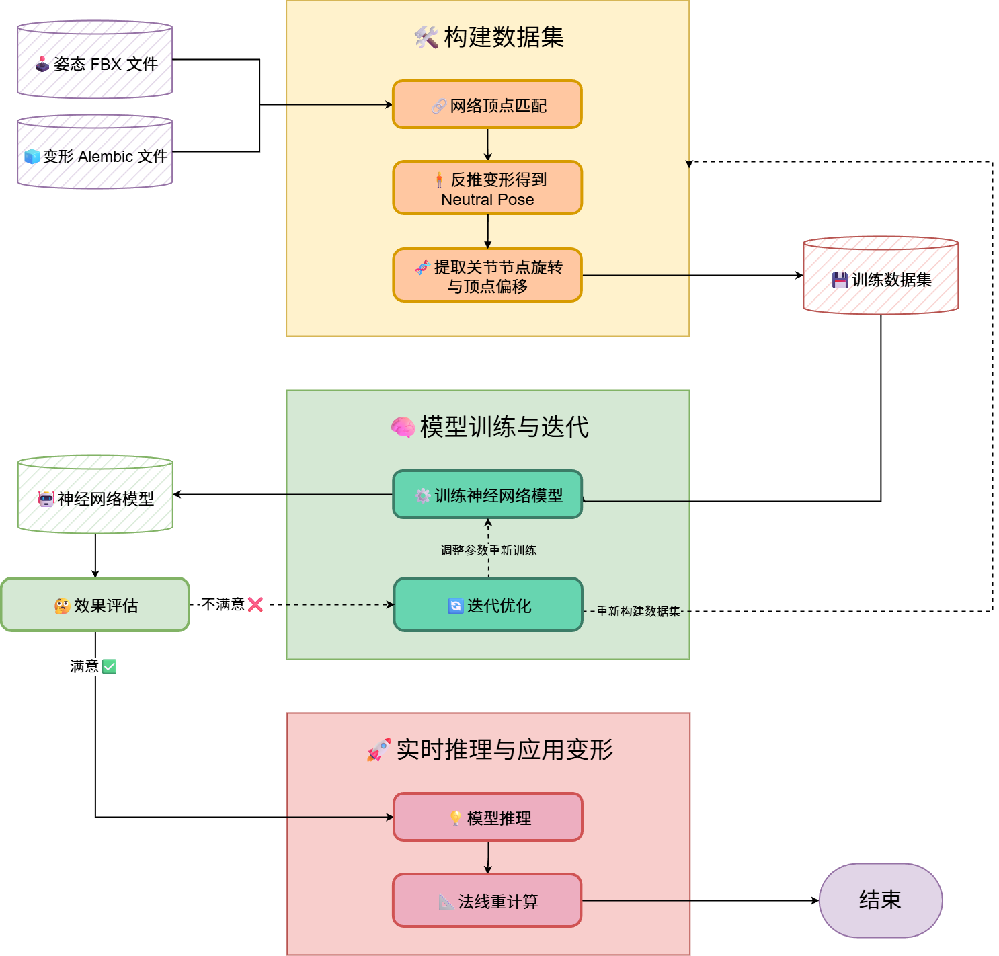

# 快速上手

本节介绍如何在团结引擎（Tuanjie Engine）项目中[安装神经变形器包](install-package.md)，并了解其基本工作流程。

## 神经变形器的工作流

完成安装后，您可以按照以下工作流使用神经变形器进行网格变形：

**神经变形器**包在团结引擎中提供了一系列专门的组件，分别对应上述各个步骤，并开放了必要的参数设置接口和便捷的图形化操作界面。

您可以通过这些组件，按照以下步骤完成网格变形任务：

1. [使用 Neural Deformer Dataset Builder 构建训练数据集](dataset-builder.md)：该组件用于从角色动画与Alembic网格变形数据中自动构建训练所需的数据集，包括顶点匹配、动画采样与数据导出等功能；

2. [使用 Neural Deformer Trainer 训练神经网络模型](trainer.md)：该组件提供可视化的模型训练管理界面，允许在团结引擎内配置训练超参数、管理训练流程、查看日志与结果；

3. [使用 Neural Deformer Player 应用网格变形](player.md)：该组件加载并运行训练好的神经网络模型，通过CPU/GPU硬件后端进行推理，驱动网格实时变形并完成法线重计算。
