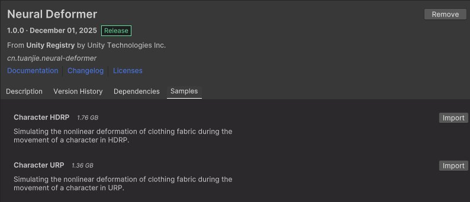
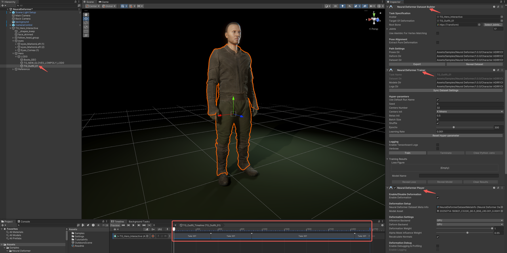

# 示例项目

1. 在Package Manager窗口中，选中Neural Deformer，在右侧页面选择"Samples"标签。根据当前项目所适配的渲染管线（URP/HDRP），选择对应的示例，点击"Import"导入到当前项目中。

    

2. 打开示例场景（以 Character URP为例），示例场景的路径为：`Assets/Samples/Neural Deformer/<packageversion>/Character URP/Scenes/NeuralDeformer.unity`，Character HDRP的操作方法与之类似。

3. 在 Hierarchy中导航并选中`TG_Hero_Interactive`\>`Hero`\>`LOD0`\>`TG_Outfit_01`，这是该人物的服装 GameObject。在 `Inspector` 窗口里可看到，该  GameObject 已经预先挂载好和 Neural Deformer 有关的组件，以及一个包含4组角色动画的 Timeline。

    

4. 在 `Inspector` 窗口中找到`Neural Deformer Player`组件，确保它处于激活状态且`Enable Deformation`被选中。

5. 在编辑模式下，打开Timeline窗口，设置人物动画的时间节点。接着，在`Neural Deformer Player`组件中调整`Deformation Weight`和`Alpha Mask Influence Weight`的值，并在场景中观察角色服装的形变情况。

6. 点击`Play`按钮进入Play Mode，检查Runtime下角色服装的形变情况。
