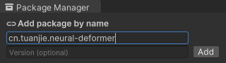

# 安装神经变形器包

要将**神经变形器**包添加到团结引擎项目：

1. 创建一个新的团结引擎项目或打开一个现有的项目；

2. 转到 `Window` \> `Package Manager`；

3. 在`Package Manager`窗口中，选择 `+` \> `Add package by name...`；

4. 输入 `cn.tuanjie.neural-deformer`；

5. 点击"添加"以将包添加到您的项目中。

    