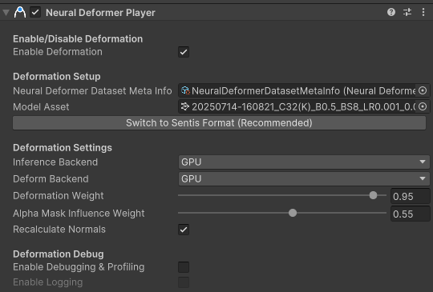
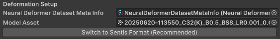
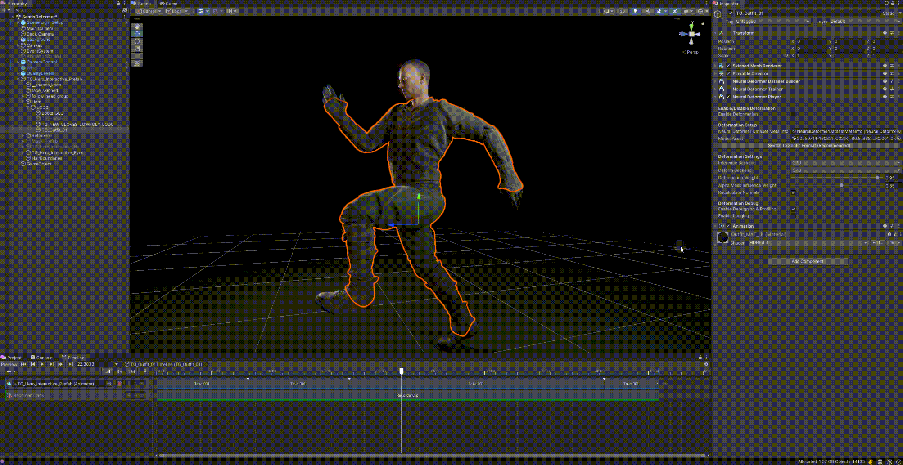

# 使用 Neural Deformer Player 应用网格变形

Neural Deformer Player 组件是神经变形器的核心组件，其主要作用是基于训练好的神经网络模型实现网格的变形效果。它支持在 CPU 和 GPU 上进行推理和变形处理，适用于需要高效、动态角色或物体变形的场景（如数字人、动画角色等）。

首先，选择场景中需要变形的网格游戏对象，且确保已绑定了 `Skinned Mesh Renderer` 后，在 `Inspector` 下方点击`Add Compoent` \> `Neural Deformer` \> `Neural Deformer Player`，可添加该组件。

Deformer Data Player组件的Inspector界面如下所示：

| **属性名称** | **详细解释** |
| --- | --- |
| **Enable Deformation** | 是否启用网格变形功能。 勾选后，神经网络推理和变形流程将被激活，网格会根据模型输出进行实时变形。 关闭后，网格恢复为原始形态。 |
| **Neural Deformer Dataset Meta Info** | 适用于当前网格的变形数据元信息。 需要指定一个通过 [Neural Deformer Dataset Builder](dataset-builder.md) 生成的 ScriptableObject，其中包含：顶点映射、关节信息等内容。 这是变形流程的基础数据来源。 |
| **Model Asset** | 神经网络模型资源。 需要指定一个 `.onnx` 或 `.sentis` 格式的模型文件，用于驱动变形推理。 模型会根据输入关节信息输出顶点变形数据。 |
| *Switch to Sentis Format (Recommended)* | 若当前选择的是 `.onnx` 模型文件，则会出现该按键：   点击该按键后，编辑器会自动把当前选择的 `.onnx` 模型转换成 [Sentis推理框架](https://docs.unity.cn/Packages/com.unity.sentis@2.1/index.html) 推荐的 `.sentis` 格式，并保存在同一目录下，然后自动切换引用到新的 `.sentis `文件。 由于 `.sentis` 格式是 Sentis 推理引擎的原生格式，加载和推理速度更快且兼容性更好，推荐开发者在项目中优先使用 `.sentis` 格式，提升运行效率和稳定性。 |
| **Inference Backend** | 神经网络模型推理的硬件后端类型：  **CPU**：基于 [Burst](https://docs.unity.cn/Packages/com.unity.burst@latest/) 的 CPU 推理； **GPU**：基于带命令缓冲区的计算着色器实现的 GPU 推理。 更多信息请参考：[Sentis 如何运行模型](https://docs.unity.cn/Packages/com.unity.sentis@2.1/manual/how-sentis-runs-a-model.html)。 |
| **Deform Backend** | 网格应用变形和法线重计算的硬件后端类型，通常来说 **GPU** 适用于绝大多数任务，**CPU** 仅适用于调试或其他特殊需求。 |
| **Deformation Weight** | 整体变形强度的控制权重，取值范围为 0 到 1，用于平滑变形效果。 该值控制变形的强度，0 表示不变形，1 表示完全按照神经网络输出进行变形。 |
| **Alpha Mask Influence Weight** | 透明度遮罩（Alpha Mask）对顶点变形强度影响的控制权重，取值范围为 0 到 1，其主要作用体现在顶点变形加权计算中。 该参数允许使用顶点颜色的 Alpha 通道值来对每个顶点的变形影响程度进行局部控制：  0 表示完全忽略透明度遮罩的影响，所有顶点按 Deformation Weight 的强度进行变形；  1 表示完全使用 Alpha 通道值参与权重计算。 |
| **Recalculate Normals** | 是否在变形后重新计算法线。 开启后，每次变形都会自动重算法线，保证光照和渲染效果正确。 关闭后，法线不会自动更新，适合对性能有极高要求且不关心法线变化的场景。 |
| **Enable Debugging & Profiling** | 是否启用变形调试和性能分析。 开启后，相关流程会记录调试和性能数据，便于开发和优化。 关闭后不会输出调试信息，适合正式发布。 |
| **Enable Logging** | 在启用 `Enable Debugging & Profiling` 后，是否将详细调试日志输出到控制台。 开启后，变形流程中的关键步骤和数据会被打印到控制台，便于排查问题。 |

完成上述`Neural Deformer Dataset Meta Info`和`Model Asset`的配置后，即可启用Neural Deformer Player组件，实现网格变形：

## 最佳实践

1. 不同设置下，性能表现如下表所示：

    | `Inference Backend` | `Deform Backend` | 性能表现 |
    | :-----------------: | :--------------: | :--: |
    |        `GPU`        |       `GPU`      |  最佳  |
    |        `CPU`        |       `GPU`      |  较好  |
    |        `CPU`        |       `CPU`      |  较差  |
    |        `GPU`        |       `CPU`      |  最差  |

2. `Deform Backend` 选择 `CPU` 会带来显著的性能下降，强烈建议在硬件条件允许的情况下，默认使用 `GPU`。

3. `Inference Backend` 对整体性能影响不大，但需要根据硬件条件选择最佳设置：

    - 在GPU资源充足、性能较强的设备上，`Inference Backend`推荐选择 `GPU`，如大部分台式机、高性能手机等。

    - 在GPU资源受限、性能较弱的设备上，`Inference Backend`可以考虑选择 `CPU`，如型号偏老旧的智能手机。
