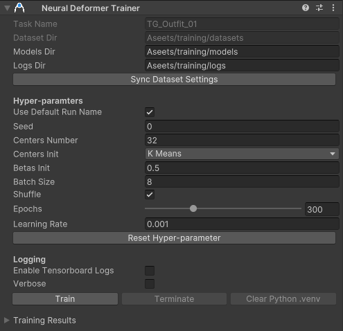
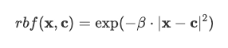
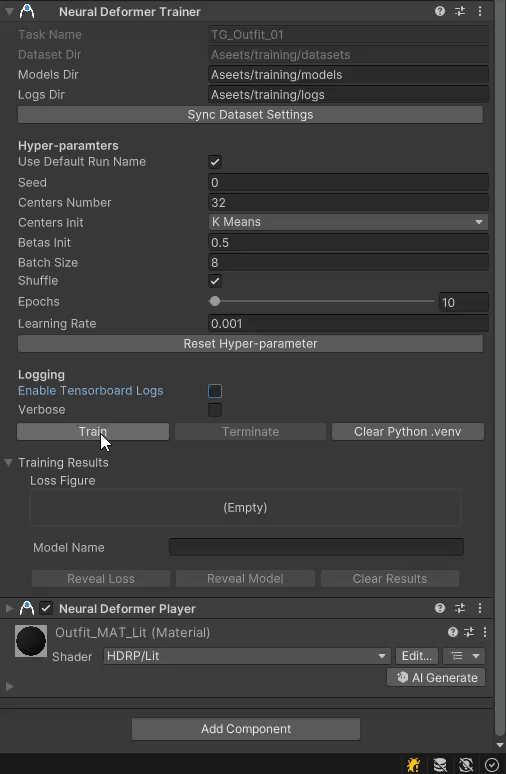
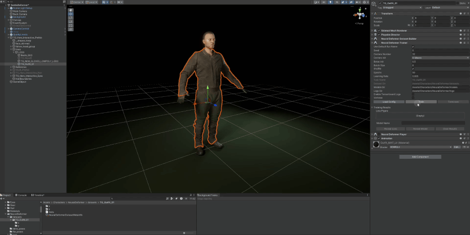

# 使用 Neural Deformer Trainer 训练神经网络模型

`Deformer Data Trainer`组件的主要作用是：设置神经网络训练的各种属性与超参数，直接在编辑器界面启动或终止训练流程，并预览训练结果。全过程无需再切换到其他环境手动执行，工作流简洁流畅。

>[!NOTE]
>`Deformer Data Trainer`组件依赖于 Python 的环境管理工具 `uv`，在使用该组件前，**请确保您的环境已经正确安装好 `uv`**，请参考[`uv`安装说明](https://docs.astral.sh/uv/getting-started/installation/)。

首先，**选择挂载了`Deformer Data Dataset Builder`组件的游戏对象**，在 `Inspector` 下方点击`Add Compoent` \> `Neural Deformer` \> `Neural DeformerTrainer`，可添加该组件。

`Deformer Data Trainer`组件的`Inspector`界面如下所示：

| **属性名称** | **详细解释** |
| --- | --- |
| **Task Name** | 该组件训练的目标网格名称，从 `Deformer Data Dataset Builder` 组件的 `Target Of Deformation` 属性读取，不可更改。 |
| **Dataset Dir** | 训练数据集的存放目录，从 `Deformer Data Dataset Builder` 组件的 `Dataset Dir` 属性读取，不可更改。 |
| **Models Dir** | 神经网络模型的存放目录，默认值为与 `Dataset Dir` 同级的 "models" 目录。 |
| **Logs Dir** | 训练日志与损失曲线的存放目录，默认值为与 `Dataset Dir` 同级的 "logs" 目录。 |
| **Use Default Run Name** | 是否使用默认运行名称，默认勾选。 默认运行名称由启动训练的时刻决定，格式为 `"YYYYmmdd-HHMMSS"`，例如 2025 年 7 月 16 日 15:01:21，则默认名称为 `"20250716-150121"`。 如果取消勾选，则用户需在 Run Name 属性中自定义名称。 运行名称用于神经网络模型的命名，用于标识，与训练效果无关。 |
| *Run Name* | 用户自定义的运行名称。 |
| **Seed** | 随机数种子，负数时无效，默认值为 0。 |
| **Centers Number** | 神经网络中 RBF 层的中心特征数量，默认值为 32。 RBF 层用于提取特征，计算公式为：  其中：*x* 和 *c* 分别是待提取特征与中心特征，它们是尺寸相同的张量，*β* 为系数。训练时 *c* 与 *β* 均持续优化。 |
| **Centers Init** | 神经网络中 RBF 层中心特征的初始化方式：`K Means` 或 `Random`，默认值为 `K Means`。 `K Means`：对训练集所有特征执行 K-Means 聚类（K = Centers Number），并将每个聚类中心作为初始值。 `Random`：随机初始化中心特征。 |
| **Betas Init** | 神经网络中 RBF 层的 *β* 初始值，默认值为 **0.5**。 |
| **Batch Size** | 每次训练迭代的批处理大小，默认值为 **8**。 |
| **Shuffle** | 是否在训练之前对训练集样本进行打乱，默认勾选。 |
| **Epoch** | 训练的总轮数，默认值为 **300**。 |
| **Learning Rate** | 训练的初始学习率，默认值为 **0.001**。 训练过程中，学习率按照 [CosineAnnealingLR](https://docs.pytorch.org/docs/stable/generated/torch.optim.lr_scheduler.CosineAnnealingLR.html) 方式变化。 |
| **Enable Tensorboard Logs** | 是否开启 Tensorboard 日志，默认不勾选。 |
| **Verbose** | 是否将训练信息打印到编辑器控制台，默认不勾选。 |

组件操作方法如下：

- 点击`Sync Dataset Settings`按键，可同步训练数据集的任务与路径信息。

- 点击`Reset Hyper-parameters`按键，可重置超参数为默认设置。

- 点击`Train`按键，可启动一次训练流程，训练进度可在`Inspector`和编辑器的`Background
Tasks`窗口实时查看。

    - 首次训练会临时安装Python虚拟环境以及相关依赖包，这使得在正式开始首次训练前将出现较长时间的停顿，请耐心等待。

- 点击`Terminate`按键，可终止正在执行的训练流程。

- 点击`Clear Python .venv`按键，可清除Python虚拟环境以及相关依赖包

训练完成以后，`Inspector`面板下方会自动展示本次训练的损失曲线和模型名称。点击`Reveal Loss`和`Reveal Model`按键，可分别跳转至损失曲线和模型所在目录，点击`Clear Results`清除展示结果。
