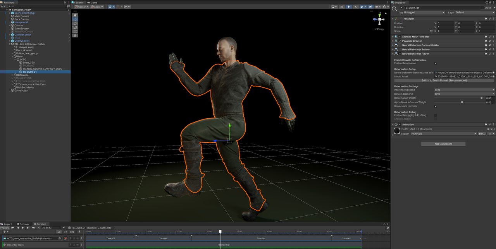

# Neural Deformer

> ⚠️ This package was extracted from [Tuanjie Engine](https://unity.cn/tuanjie), the Chinese fork of Unity maintained by Unity China. It is not officially available in the global Unity registry. I ripped it and put it here so you don't have to.

To add: just add by git url `https://github.com/JuelzIrons/cn.tuanjie.neural-deformer.git`
This Very likely will not work as unity china has specific source code edits that may not be compatable

**A Machine Learning-Based High-Fidelity Real-Time Mesh Deformation Solution for Tuanjie Engine.**

## ✨ Introduction

Neural Deformer is an efficient solution designed to achieve **high-quality non-linear deformation** for skinned meshes in character animation while effectively avoiding the significant performance overhead associated with traditional complex geometric calculations.

### Core Features

* **High-Fidelity Real-Time Deformation:** Utilizes a lightweight neural network model trained on complex deformation data captured from Digital Content Creation (DCC) software to reproduce high-precision cloth, muscle, and equipment effects at runtime with minimal cost.
* **Integrated Workflow:** All core functionalities—data processing, model training, and model inference—are performed entirely within the Tuanjie Editor.
* **Multi-Platform Support:** Built upon the Sentis inference framework, supporting deployment across multiple platforms including Windows, MacOS, Android, and iOS.
* **Hardware Backend Flexibility:** Both model inference and deformation calculation support **CPU** and **GPU** backends, allowing developers to switch as needed to optimize performance for different hardware resources.

### Applications

| Feature | Example |
| :--- | :--- |
| **💪 Muscle Deformation** |  |
| **👕 Cloth Deformation** |  |

## 🛠️ Core Workflow Components

The Neural Deformer package provides three specialized components corresponding to the primary stages of a mesh deformation task:

| Step | Component Name | Function |
| :--- | :--- | :--- |
| 1. Dataset Construction | Neural Deformer Dataset Builder | Automatically extracts and structures training data from FBX animations and Alembic deformation caches. |
| 2. Model Training | Neural Deformer Trainer | Manages hyperparameter configuration and initiates neural network training directly within the Tuanjie Editor. |
| 3. Deformation Application | Neural Deformer Player | Loads the trained model and drives the mesh's real-time deformation using the specified CPU/GPU backend. |

## 🔗 More Information

See: [**Official Documentation**](https://docs.unity.cn/cn/Packages-cn/cn.tuanjie.neural-deformer@1.0/manual/).

## 📜 LICENSE

See: [LICENSE.md](LICENSE.md).
